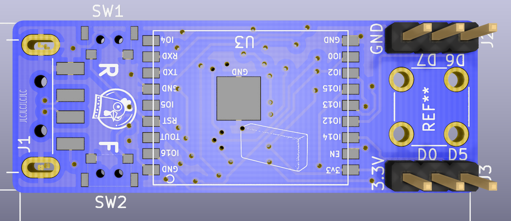

# Deauther Andromeda PCB

PCB files for the Deauther Andromeda

<a href="https://spacehuhn.store/product/deauther-andromeda/">
     
    Click here to purchase one from the store
</a>

## About the product

A USB-powered WiFi pentesting tool based on the ESP8266. 
Optimized for the [ESP8266 Deauther V3](https://github.com/SpacehuhnTech/esp8266_deauther/tree/v3) and [Huhnitor](https://github.com/spacehuhntech/huhnitor).  

Hardware features include:  
* SMA antenna connector
* USB-A plug
* ESP8266 WROOM 4MB Module
* FTDI serial chip

## Format

Made with [KiCad](https://kicad-pcb.org/) version 5.1.4

## Firmware

[ESP8266 Deauther](https://github.com/SpacehuhnTech/esp8266_deauther)

## License

This hardware design is published under CERN Open Hardware Licence Version 2 - Permissive, see the [license file](LICENSE) for details.

Designed by [Gerjon Eilander](https://github.com/13r1ckz) for Spacehuhn Technologies.

[Spacehuhn Technologies](https://spacehuhn.tech) invests time and resources providing this open source design, please consider supporting us by purchasing from [our store](https://spacehuhn.store).  